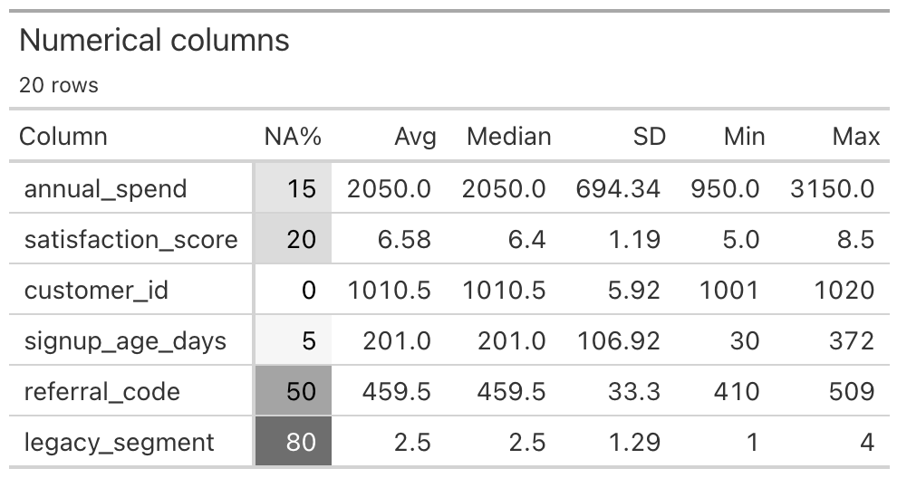

**showstats** quickly produces compact summary statistic tables with vertical orientation.

```{python}
# | output: false
# | echo: false
import sys

sys.path.append("src/")
```

```{python}
import polars as pl
from showstats import show_stats

# Daily weather in Seattle, 2012-2015
df = pl.read_csv("docs/data/seattle-weather.csv", try_parse_dates=True)

show_stats(df)
```

```{python}
# Only one type
show_stats(df, "cat")  # Other are num, time
```


```{python}
# Any subset of columns works
show_stats(df.select("temp_max", "wind"))
```

```{python}
# Add extra quantiles for numerical columns
show_stats(df.select("temp_max", "wind"), "num", quantiles=[0.1, 0.9])
```

```{python}
# pandas, pyarrow and other narwhals-supported frames work the same way
import pandas as pd

show_stats(pd.read_csv("docs/data/seattle-weather.csv")[["temp_max", "wind"]])
```

## Optional Great Tables output

Install the optional output package with `uv add "showstats[gt]"`. The `gt`
output returns a Great Tables object that displays as HTML in a notebook. Set
`color_missing=True` to add an optional white to dark gray background scale.

```{python}
# | eval: false
table = show_stats(df, "num", fmt="gt")
table
```



- **showstats** works with any data frame [narwhals](https://github.com/narwhals-dev/narwhals) supports — polars, pandas, pyarrow and more. They all work directly, with no extra installs or conversion step.

- Heavily inspired by the great R-packages [skimr](https://github.com/ropensci/skimr) and [modelsummary](https://modelsummary.com/vignettes/datasummary.html). 

- Numbers with many digits are automatically converted to scientific notation.

- The example above uses [Seattle daily weather](https://github.com/vega/vega-datasets/blob/main/data/seattle-weather.csv) from vega-datasets (BSD-3-Clause).

- Fast: under a second to summarise a 1,000,000 &times; 1,000 data frame on an M1 MacBook.
